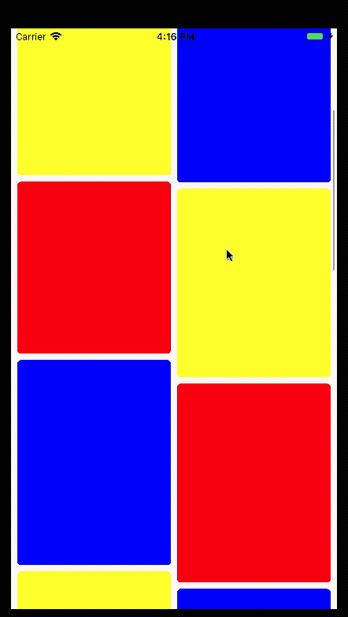

# KSYCollectionViewLayout

🚀 A waterfall flows collection view layout.

## Results the preview
  
  
## Requirements

- iOS 8.0+ 
- Swift3.0+

## Install
You can use `CocoaPods` to install `KSYCollectionViewLayout`

```
    pod 'KSYCollectionViewLayout', "~> 1.2"
```

## How to use

* init
```Swift
  let layout = KSYCollectionViewLayout()
  layout.delegate = self
```

* collection view use layout 
```Swift
  let collect = UICollectionView(frame: CGRect.zero, collectionViewLayout: layout)
```

* impl KSYCollectionViewLayoutDelegate
```Swift
extension ViewController: KSYCollectionViewLayoutDelegate {
    func numberOfColumn(in collectionView: UICollectionView) -> Int {
        return columnCount
    }
    
    func collectionView(_ collectionView: UICollectionView, layout: KSYCollectionViewLayout, heightForItemAt indexPath: IndexPath) -> CGFloat {
        let height = 200 + arc4random() % 100
        
        return CGFloat(height)
    }
}
```
